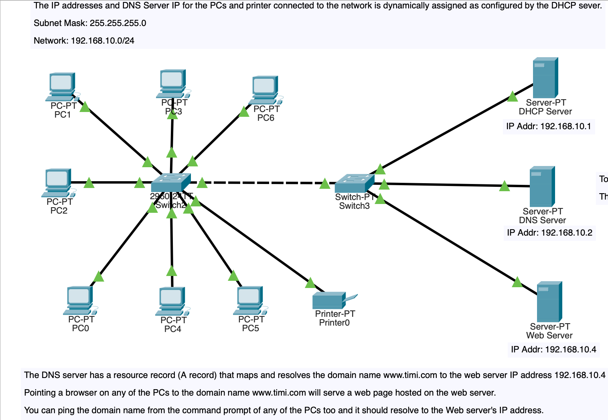

# Computer Networking Lab
Repo for my computer networking lab practicals using Cisco Packet Tracer


<!-- TABLE OF CONTENTS -->
<details>
  <summary>Table of Contents</summary>
  <ol>
  <li>
      <a href="#getting-started">Getting Started</a>
    </li>
    <li>
      <a href="#1">VLANs configured with access and trunk (802.1Q) modes.</a>
    </li>
    <li>
      <a href="#2">DHCP, DNS with PCs in a LAN.</a>
    </li>
  </ol>
</details>


<!-- GETTING STARTED -->
## Getting Started

### Prerequisites

* To run the network lab packet tracer files, make sure you have the Cisco Packet Tracer Software installed on your machine.
* Download it here if you do not have it installed already on your computer [https://www.netacad.com/resources/lab-downloads](https://www.netacad.com/resources/lab-downloads)


## 1.)
## VLANs configured with access and trunk (802.1Q) modes.
* Open and view the packet tracer file for this implementation here ```vlan/my-vlan-practice-lab.pkt``` on the Cisco Packet Tracer Software.

 <div style="text-align:center">
    
    
</div>


## 2.)
## DHCP, DNS with PCs in a LAN.
* Open and view the packet tracer file for this implementation here ```dhcp/dhcp-dns-setup.pkt``` on the Cisco Packet Tracer Software.
  
  * NOTES:
    * The IP addresses and DNS Server IP for the PCs and printer connected to the network is dynamically assigned as configured by the DHCP sever.
      * Subnet Mask: 255.255.255.0
      * Network: 192.168.10.0/24


    * To test out the auto/dynamically assigning of IP addresses on the network, add a new end device (PCs, Laptops etc.) to the network and select DHCP for IP address config. on the end device. Run "ipconfig /all" command on the end device's command prompt afterwards to check for the IP address and DNS server IP address assigned to the end device.
      * The assigned IP address should be within the network 192.168.10.0/24
  
  
    * The DNS server has a resource record (A record) that maps and resolves the domain name www.timi.com to the web server IP address 192.168.10.4
      * Pointing a browser on any of the PCs to the domain name www.timi.com will serve a web page hosted on the web server.
      * You can ping the domain name from the command prompt of any of the PCs too and it should resolve to the Web server's IP address.

 <div style="text-align:center">
    
    
    
    
    
    
</div>


<p align="right">(<a href="#getting-started">back to top</a>)</p>

<!-- LICENSE -->
## License

Distributed under the MIT License. See `LICENSE.txt` for more information.

<p align="right">(<a href="#getting-started">back to top</a>)</p>

